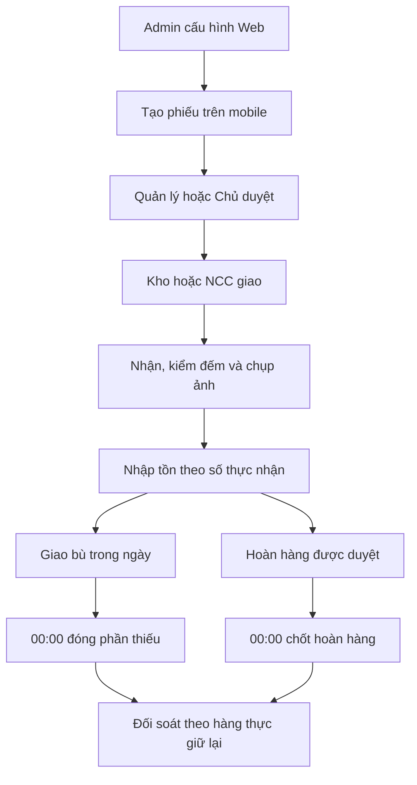

# DICA Backend

Backend quản lý cấu hình, cấp hàng và tồn kho DICA. Web dành cho cấu hình; mobile dùng API tạo, duyệt và xử lý nghiệp vụ. Nhà cung cấp dùng chung app, chỉ xem đơn và giá thuộc nhà cung cấp của mình.

Backend dùng NestJS, Prisma và PostgreSQL. REST API có prefix `/api/v1`; Swagger `/docs` và OpenAPI `/openapi.json` có khi bật `SWAGGER_ENABLED=true`.

## Flow hiện hành

[Câu trả lời khách ngày 08/10/2026](docs/customer-flow-questions-response.md) được ưu tiên hơn mô tả ban đầu trong [new-flow.md](new-flow.md).



- Phiếu bị từ chối phải tạo mới. Phiếu đã duyệt không sửa hàng/số lượng/nguồn; người có quyền chỉ được hủy trước lần nhận hàng đã ghi sổ.
- Bù nhiều lần trong ngày; từ 00:00 kết thúc ngày cần hàng, phần thiếu bị đóng và không tính tiền.
- Nhận thừa được cộng tồn. Mỗi lần nhận/giao bù cần 1–10 ảnh.
- Kho tổng ↔ Bếp tổng tự duyệt khi gửi, vẫn thông báo. Chi nhánh ↔ Chi nhánh và Bếp tổng ↔ Chi nhánh cần duyệt; không điều chuyển trực tiếp Chi nhánh ↔ Kho tổng. Xin hàng từ kho tổng vẫn dùng flow cấp hàng.
- Hoàn về nguồn đã cấp, chốt tồn/hóa đơn cuối ngày duyệt. Báo hỏng giảm tồn một lần khi gửi; xác nhận không trừ lần nữa.
- Kiểm kê chỉ nhập số thực tế; quyền riêng để xem lệch/điều chỉnh. Cho phép tồn vật lý âm.
- ADMIN đặt giá chuẩn, ngưỡng, xác nhận thanh toán hai người và lưu ảnh 6–12 tháng.
- Ảnh riêng tư; thông báo nhắc mỗi giờ khi chưa đọc và còn quyền tài nguyên.

## Chạy local

Yêu cầu Node.js 24.15+ và PostgreSQL 17. Database phải tồn tại trước khi migrate.

1. Chạy `npm ci`, sao chép `.env.example` thành `.env`.
2. Điền `DATABASE_URL`, hai JWT secret khác nhau, thông tin R2 và `BOOTSTRAP_ADMIN_PASSWORD` tối thiểu 12 ký tự. Thay toàn bộ placeholder.
3. Chạy:

```bash
npm run db:migrate
npm run build
node --env-file=.env dist/scripts/bootstrap.js
npm run start:dev
```

Bootstrap tạo tổ chức/admin nếu chưa có và cập nhật bộ quyền gốc v4; không đổi mật khẩu admin đã tồn tại. Tên tài khoản/mã tổ chức lấy từ `BOOTSTRAP_ADMIN_USERNAME` và `BOOTSTRAP_ORGANIZATION_CODE`.

API mặc định ở `http://localhost:3000/api/v1`. Web dùng `http://localhost:3001`; đặt URL này trong `CORS_ORIGINS`. Nếu cần dữ liệu demo, chạy `npm run db:seed` trên database development. Không seed demo trên production.

## Ảnh và thông báo

R2 cần `R2_ACCOUNT_ID`, `R2_ACCESS_KEY_ID`, `R2_SECRET_ACCESS_KEY`, `R2_BUCKET`. Bucket riêng tư, tắt `r2.dev` và public custom domain cũ; không cần `R2_PUBLIC_BASE_URL`. Mobile upload presigned PUT, finalize rồi đọc qua API với Bearer token.

Giữ `FCM_ENABLED=false` khi chưa cấu hình Firebase. Để gửi push, cấu hình biến FCM và APNs cho iOS. Inbox vẫn hoạt động khi FCM tắt; alarm native cần app triển khai và kiểm thử.

Worker chạy mỗi 30 giây để chốt thiếu/hoàn, nhắc thông báo và dọn ảnh hết hạn. Thời hạn nghiệp vụ dùng giờ Việt Nam. Migrate trước khi chạy API; khi worker lỗi, kiểm tra `npx prisma migrate status` và nguyên nhân trong log.

## Quy ước API

- Request thường dùng `snake_case`, entity response dùng `camelCase`; lấy đúng schema endpoint.
- Lượng/tiền là chuỗi thập phân; ngày `YYYY-MM-DD`, datetime ISO-8601 có timezone.
- Command có version cần `expected_version`; endpoint yêu cầu idempotency cần `Idempotency-Key`, giữ nguyên key/payload khi retry.
- Thành công gồm `success`, `data`, `message`, `request_id`, `timestamp`; danh sách có `meta` phân trang.
- Lỗi gồm `success=false`, `code`, `message`, `details` nếu có và `request_id` để tra log.
- Backend kiểm tra permission/scope; giá/chênh lệch có thể bị loại khỏi response nếu thiếu quyền xem.

Xem payload, trạng thái và retry trong [mobile-integration.md](docs/mobile-integration.md). Nhãn Mobile/Web trên Swagger không thay thế kiểm tra quyền.

## Kiểm thử

```bash
npm run typecheck
npm test
npm run build
npm run format:check
```

Test flow cần PostgreSQL riêng đã migrate. Đặt `TEST_DATABASE_URL` tới database test trước khi chạy `npm test`; không dùng database production. Thiếu biến này thì integration test bị bỏ qua. `.customer-flow-test-db` là dữ liệu test local, không commit.

## CI và deploy

Pull request chạy kiểm tra, migrate PostgreSQL test rồi chạy test. Push vào `main` tiếp tục build image GHCR và deploy qua SSH nếu environment `production` cùng secret VPS đã cấu hình. Environment có thể yêu cầu duyệt deploy.

Compose chạy `db:migrate` và `db:bootstrap` trước khi bật API. `.env.production` nằm trên VPS; xem [hướng dẫn deploy](docs/deployment-vps.md). Không commit secret, dữ liệu PostgreSQL hoặc ảnh chứng từ.

## Tình trạng triển khai

Web, API và contract mobile đã được đối chiếu; [review hiện hành](docs/new-flow-implementation-review.md) ghi rõ bằng chứng. Theo dõi phần đã có và việc còn lại trong [TASK.md](TASK.md).

Workspace chưa có source mobile. iPOS thật, alarm native, R2/FCM thật và mẫu hóa đơn/PDF cần kiểm thử hoặc triển khai với ứng dụng/dịch vụ tương ứng. Backend hiện có import bán hàng thủ công và hủy bản ghi import, chưa xác nhận nhận hóa đơn iPOS production.
