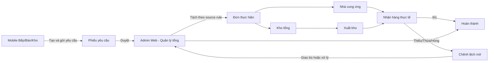
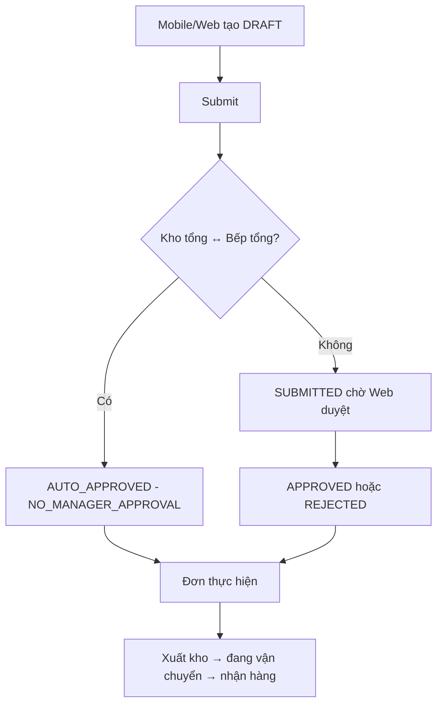

# Flow vận hành DICA từ Figma

Tài liệu này chốt luồng nghiệp vụ giữa Admin Web, ứng dụng Mobile DICA và backend sau khi đối chiếu file `Untitled.fig`. API dùng chung base path `/api/v1`; quyền thực tế luôn do permission và scope của tài khoản quyết định.

## Phân chia client

| Ký hiệu trong Swagger  | Client tích hợp | Ý nghĩa                                                        |
| ---------------------- | --------------- | -------------------------------------------------------------- |
| `[MOBILE]`             | Mobile          | Tác vụ hiện trường; Admin Web không cần gọi                    |
| `[ADMIN WEB]`          | Web             | Cấu hình, duyệt, xử lý ngoại lệ, báo cáo; Mobile không cần gọi |
| `[MOBILE + ADMIN WEB]` | Cả hai          | Hai client dùng chung endpoint theo quyền được cấp             |
| `[SYSTEM]`             | Hạ tầng         | Health/monitoring, không phải màn hình nghiệp vụ               |

OpenAPI còn xuất extension `x-dica-audience` để client hoặc tool sinh mã lọc endpoint theo đối tượng tích hợp.

## Flow tổng

### 1. Xin hàng từ Bếp/Bàn/Chi nhánh

1. Web cấu hình cơ sở, kho, bộ phận, quyền, nguyên liệu được phép xin và nguồn cấp.
2. Mobile/Web lấy `item-eligibility` theo cơ sở + bộ phận; người dùng chỉ chọn được nguyên liệu hợp lệ và không vượt `maxQuantityPerRequest` sau khi quy đổi về đơn vị cơ sở.
3. Người dùng tạo `DRAFT`, có thể sửa, sau đó `submit`.
4. Backend chụp snapshot quy đổi và source rule tại thời điểm gửi.
5. Quản lý tổng duyệt trên Web. Backend tách một yêu cầu thành các đơn kho/NCC theo nguồn, không để client tự quyết định nguồn.
6. Đơn NCC chỉ xuất hiện cho đúng tài khoản NCC sau khi đã phát hành.

Trạng thái: `DRAFT → SUBMITTED → APPROVED` hoặc `REJECTED/CANCELLED`. Phiếu bị từ chối có thể `revise` rồi gửi lại.

### 2. Xuất và nhận hàng

1. Nhân sự kho lập phiếu xuất từ đơn nguồn kho và ghi sổ bằng `dispatches/{id}/post`.
2. Người nhận lập phiếu nhận theo số lượng kiểm thực tế, không theo số đã đặt.
3. Khi ghi sổ nhận, backend cộng lượng được chấp nhận vào kho nhận và tự tạo chênh lệch thiếu/thừa nếu có. Hàng hỏng trong tồn đi theo flow báo hỏng riêng.
4. Thiếu hàng vẫn để đơn ở `PARTIAL`; có thể nhận bù nhiều lần, kể cả khác ngày.
5. Chỉ Web có quyền xử lý chênh lệch hoặc đóng phần còn thiếu với lý do. Không ghi đè lịch sử lần nhận cũ.

Các thao tác ghi sổ bắt buộc `Idempotency-Key` để tránh ghi tồn hai lần khi client retry.

### 3. Điều chuyển giữa cơ sở

Backend tự xác định cặp cơ sở; client không được truyền cờ bỏ duyệt. Dù tự duyệt, hệ thống vẫn ghi approval event, audit và notification.

### 4. Kiểm kê, hao hụt và iPOS

- Mobile lập/cập nhật/gửi phiếu kiểm kê cuối ngày; Web theo dõi và có thể mở lại theo quyền.
- Mobile hoặc Web có thể lập báo hỏng. Phiếu bắt buộc đi qua `DRAFT → SUBMITTED → CONFIRMED`; chỉ khi `CONFIRMED` mới trừ tồn.
- Web import dữ liệu bán hàng iPOS, cấu hình mapping/định mức và chạy tính chênh lệch. Mobile chỉ cần hiển thị kết quả/cảnh báo nếu sản phẩm yêu cầu sau này; không gọi nhóm API cấu hình iPOS.
- Báo cáo tồn, đáp ứng, chênh lệch, hỏng và thanh toán thuộc Admin Web.

## Ma trận trách nhiệm và trạng thái tích hợp

| Nghiệp vụ                          | Mobile cần tích hợp  | Admin Web                        | Backend                              |
| ---------------------------------- | -------------------- | -------------------------------- | ------------------------------------ |
| Đăng nhập, hồ sơ, quyền, thông báo | Có                   | Đã tích hợp                      | Hoàn tất                             |
| Tra cứu cơ sở/bộ phận/kho/danh mục | Có                   | Đã tích hợp                      | Hoàn tất                             |
| Xin hàng, sửa, gửi, hủy            | Có                   | Đã tích hợp để thao tác dự phòng | Hoàn tất                             |
| Duyệt/từ chối yêu cầu              | Không                | Đã tích hợp                      | Hoàn tất                             |
| Xem đơn và tiến độ                 | Có                   | Đã tích hợp                      | Hoàn tất                             |
| Xuất/nhận hàng và giao bù          | Có theo permission   | Đã tích hợp                      | Hoàn tất                             |
| Xử lý chênh lệch/đóng phần thiếu   | Chỉ xem              | Đã tích hợp                      | Hoàn tất                             |
| Điều chuyển                        | Có                   | Đã tích hợp                      | Hoàn tất, có tự duyệt cặp trung tâm  |
| Kiểm kê                            | Có                   | Đã tích hợp phần giám sát        | Hoàn tất                             |
| Báo hỏng                           | Có                   | Đã tích hợp lập/gửi/xác nhận     | Hoàn tất phần dữ liệu                |
| iPOS, định mức, báo cáo, payment   | Không                | Đã tích hợp                      | Hoàn tất adapter import thủ công     |
| Nhà cung ứng xem đơn của mình      | Có trong Mobile DICA | Không cần                        | Hoàn tất projection riêng, read-only |

Mobile client chưa nằm trong workspace này, vì vậy “Có” ở cột Mobile nghĩa là API contract đã sẵn sàng và mobile dev cần tích hợp theo [mobile-integration.md](mobile-integration.md).

## Các điểm giữ nguyên hoặc hoãn

- Tên vai trò trong Figma được ánh xạ bằng permission + scope hiện có, không tạo thêm role cứng chỉ để khớp nhãn giao diện. Admin có thể cấp nhiều role/phạm vi cho một tài khoản.
- Việc tạo Chi nhánh, kho và hai bộ phận Bếp/Bàn vẫn là các cấu hình độc lập trên Web để không phá dữ liệu/cấu trúc hiện có. Seed demo đã tạo đúng hai bộ phận cho mỗi chi nhánh.
- Ảnh khi nhận hàng/báo hỏng chưa có API upload vì chưa chốt storage, loại file và giới hạn dung lượng (`OPEN-08`). Dữ liệu nhận thiếu/thừa và báo hỏng vẫn hoạt động; Mobile không tự gửi base64 hoặc URL ngoài vào trường ghi chú.
- Hàng hỏng bị từ chối ngay lúc nhận hiện được nhập theo lượng chấp nhận thực tế và ghi chú, nên case sẽ thể hiện phần thiếu; chưa có trường phân loại `DAMAGED`/flow trả hàng NCC riêng cho tới khi policy hoàn/trả được chốt (`OPEN-01`).
- `An toàn`, `Lưu mẫu`, `Truy xuất lô`, app khách hàng/đánh giá và chấm công trong mockup là phạm vi làm sau, chưa phát hành endpoint giả.
- Kết nối iPOS hiện là adapter import thủ công có validate/preview/commit; chưa gọi API iPOS production cho tới khi có tài liệu đối tác.
- Các command xử lý ngoại lệ làm thay đổi tồn (xác nhận báo hỏng, xử lý thừa, đóng phần thiếu và điều chỉnh) vẫn tuân theo policy production hiện hành; khi policy chưa bật backend trả `POLICY_NOT_CONFIGURED`, không giả lập thành công.
